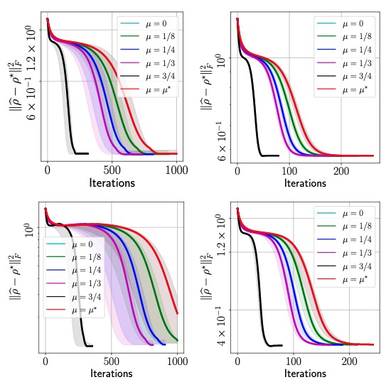

# MiFGD


[](https://arxiv.org/abs/2104.07006)

## Overview

This repository provides code implementation of "Fast quantum state reconstruction via accelerated non-convex programming" (https://arxiv.org/abs/2104.07006). The proposed method is called **M**omentum-**i**nspired **F**actorized **G**radient **D**escent (MiFGD), and it combines ideas from compressed sensing, non-convex optimization, and acceleration methods. In a nutshell, MiFGD  can reconstruct an unknown low-rank density matrix given the corresponding set of measurements much more efficiently compared to other convex methods.

```Note: please use Day theme on Github to read mathematical expressions below.```

### Problem description

Specifically, we consider the reconstruction of a low-rank density matrix  on a _n_-qubit Hilbert space, where , through the following _L2_-norm reconstruction objective:

<!-- &space;:=&space;\tfrac{1}{2}&space;||\mathcal{A}(\rho)&space;-&space;y||_2^2&space;\\\\&space;&&space;\text{subject&space;to}&space;&&space;&&space;\rho&space;\succeq&space;0,&space;~\texttt{rank}(\rho)&space;\leq&space;r.&space;\end{aligned})  -->

<p align="center">  </p>


where  is the measured data through quantum computer or simulation, and :&space;\mathbb{C}^{d\times&space;d}&space;\rightarrow&space;\mathbb{R}^m) is the linear sensing map. The sensing map relates the density matrix  to the measurements through Born rule: &space;\right)_i&space;=&space;\texttt{Tr}(A_i&space;\rho)), where  are the sensing matrices.

From the objective function above, we see two constraints:   
1. (Convex constraint) Positive semidefiniteness:   
2. (Non-convex constraint) Low-rankness: &space;\leq&space;r)

Instead of solving the original optimization problem with the above constraints, we propose to solve a factorized version:

<!-- &space;:=&space;\tfrac{1}{2}&space;||\mathcal{A}(UU^\dagger)&space;-&space;y||_2^2.) -->

<p align="center">  </p>


By factorizing the density matrix , both constraints are automatically satisfied.

### Method and algorithm

To solve the factorized objective function above, we propose **M**omentum-**i**nspired **F**actorized **G**radient **D**escent (MiFGD), which iterates as follows:

<!-- &space;-&space;y\right)&space;\cdot&space;Z_i,&space;\\\\&space;Z_{i&plus;1}&space;&=&space;U_{i&plus;1}&space;&plus;&space;\mu&space;\left(U_{i&plus;1}&space;-&space;U_i\right).&space;\end{aligned})
 -->
<p align="center">  </p>

Here,  is a rectangular matrix which accumulates the "momentum" of the iterates .  is the momentum parameter that balances the weight between the previous estimate  and the current estimate .

### Performance

We briefly review the performance of MiFGD using real quantum data, which we obtained from IBM's Quantum Processing Unit (QPU) by realizing two types of quantum states: _GHZminus_ (top) and _Hadamard_ (bottom), for _n = 6_ (left) and _n = 8_ (right), where _n_ is the number of qubits. We highlight that, in the following plots, we only use 20% of the measurements that are information-theoretically compelete. We compare the effect of different momentum parameters in the figure below, where the accuracy of the estimated and the true density matrix is measured in terms of the squared Frobenius norm: . 

<!--  -->
<p align="center">  </p>

Above figure summarizes the performance of MiFGD. In the legends,  is the momentum parameter proposed by our theory; however, it should be noted that MiFGD converges with larger momentum values, in particular featuring a steep dive to convergence for the largest value of  we tested. Moreover, the above figure also highlights the universality of our approach: its performance is oblivious to the quantum state reconstructed, as long as it satisfies purity or it is close to a pure state. Our method does not require any additional structure assumptions in the quantum state.

## Install

- Install Miniconda: https://docs.conda.io/en/latest/miniconda.html

- Create a conda environment: `mifgd`
```
conda env create -f environment.yml
```

## Run the example notebook

- Activate the environment:
```
conda activate mifgd
```

- `cd` to  `notebooks/`:
```
cd notebooks
```

- Launch a `jupyter lab` session from a terminal:
```
jupyter lab
```

- Work in your browser: Open `qutomo_example.ipynb` and execute its cells.


- When you finish working, deactivate the environment: 

```
conda deactivate
```

## Citation

```
@article{kim2021fast,
  title={Fast quantum state reconstruction via accelerated non-convex programming},
  author={Kim, Junhyung Lyle and Kollias, George and Kalev, Amir and Wei, Ken X and Kyrillidis, Anastasios},
  journal={arXiv preprint arXiv:2104.07006},
  year={2021}
}
```

